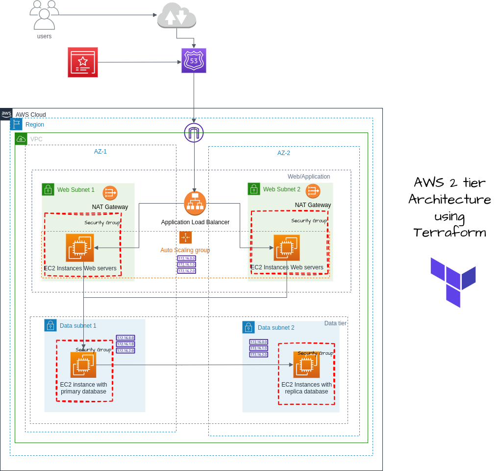

# Concept of 2 tier web application architecture is implemented in AWS cloud with terraform in modular approach.

I have utilized a modular approach, variables, and data sources to make the code reusable and easy to manage. The static files are stored in a remote S3 bucket, and I have implemented security measures to ensure the safety of data. Additionally, I have used a custom domain for routing, providing a seamless user experience.

If you want to learn more about my approach and the challenges I faced during this project, check out my latest blog post where I share my experience in detail:

https://lnkd.in/dYy2-bbK

Image :

